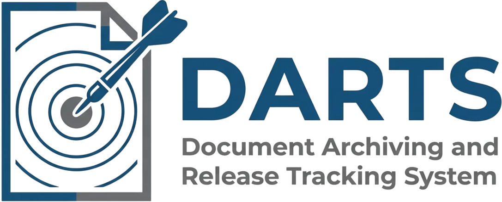

<div align="center">

</div>
<br>
<p align="center">
<div align="center">
    
    
    
    
    
</div>
<div align="center">
    
    
    
</div>
</p>

## Overview

*DARTS (Document Archiving and Release Tracking System)* is a web-based document management solution designed to digitalize and streamline the entire document request lifecycle—from submission and routing to processing, tracking, and archiving. It eliminates manual inefficiencies such as paper forms, misplaced files, and lack of real-time visibility.

The system serves multiple user roles:
- *Requesters* (Employees or Clients)
- *Routing Officers*
- *Assigned Personnel*
- *System Administrators & Archive Officers*

🚀 Built with **Laravel MVC**, **MySQL**, **Laravel Fortify**, and **Google OAuth 2.0**.


---

## Features
| Feature | Description |
|---------|-------------|
| 🔐 *User Management* | Email/password + Google SSO login, role-based permissions |
| 📝 *Document Request* | Submit requests with attachments, auto-generated Tracking ID |
| 🔄 *Multi-stage Routing* | Configurable approval workflows with escalation |
| 👥 *Assignment Module* | Assign requests to specific personnel |
| 📢 *Notifications* | Automated email/in-app alerts on status changes |
| 📦 *Archiving* | Completed requests stored with full history (no duplication) |
| 📊 *Dashboards & Reports* | Real-time request summaries, charts, exportable reports |
---

## Screenshots


---

## System Architecture

- *Type* : Web Application
- *Architecture* : MVC (Model-View-Controller)
- *Backend* : Laravel PHP Framework
- *Frontend* : Blade templates, HTML5, CSS3
- *Database* : MySQL (via Eloquent ORM)
- *Authentication* : Laravel Fortify + Laravel Socialite (Google OAuth 2.0)

### Core Modules
- User Management
- Document Request Module
- Routing Module
- Assignment Module
- Notification Module
- Archive Module
- Dashboard / Reporting

---

## Technologies & Tools

| Category          | Tools |
|-------------------|-------|
| Language          | PHP 8.2+ |
| Framework         | Laravel 12.0 |
| Database          | MySQL 8.0 |
| Frontend          | Blade, HTML, CSS |
| Authentication    | Laravel Fortify + Laravel Socialite (Google OAuth 2.0) |
| Dev Environment   | XAMPP, VS Code, Git |


---

## Dependencies

### PHP Dependencies
```json
{
    "php": "^8.2",
    "laravel/framework": "^12.0",
    "laravel/fortify": "^1.36",
    "laravel/socialite": "^5.26",
    "laravel/tinker": "^2.10.1",
}